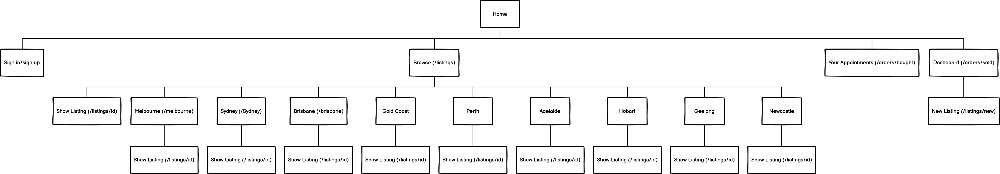

### What the app is: (Purpose, problem, target audience)
Salon Today is an appointment listing marketplace where users who provide beauty services can list their last minute appointments that become available. Other users can then browse available appointments and book those appointments.  The purpose of this application is to help people looking to save money on beauty services in their city to find people who own salons or small home run services that want to fill up last minute empty slots in their appointment calendar.

Hairdressers, makeup artists and other beauty service providers often have last minute cancellations during their days that leads to a waste of time and money. Often they turn to posting on their Instagram to let existing clients know that the spot is available to book, however it does not always get successfully filled. An application allowing them to list these last minute cancellation appointments or empty slots will allow them to fill their schedules, saving them time and maximising the money they can make during the day. By offering a discount on these last minute services, clients looking to save money who have a flexible schedule or clients looking specifically for last minute services to work with their schedule can be matched with these listings, benefiting both buyers and sellers. 

The target audience for this application is beauty service providers such as salon owners or small business owners. The buyers for this app include anyone interested in booking last minute beauty services, who live in or close to any major Australian cities. According to statista.com, the demographic who spend the most on beauty services are Gen Z and millenial females (https://www.statista.com/statistics/1271009/shoppers-spending-most-on-skin-care-in-the-beauty-sector-united-states/). More detailed examples of the target audience can be found in the user stories.

##### Link to deployed app: 
https://beautyappofficial.herokuapp.com/
##### Staging app:
https://staging-beautyapp.herokuapp.com/
##### Link to Github repo: 
https://github.com/miasydney/beautyapprepo

##### Functionality / features
As the primary functionality of this app for both sellers and buyers is creating or browsing the appointment listings, the app has been designed around providing as much useful functionality to the users regarding the listings as possible.
The home page of the app aims to inform new visitors of the purpose of the app, containing a hero section with a brief description. Below this are links to popular Australian cities where they can choose which city they want to view available appointments in. The app allows listings for most of Australia's major metropolitan cities. Custom routes have been defined within the application for each city, eg /sydney, /melbourne, so following these links will take you to that route, which then has a custom view, rendering the same listings format for consistency, but displaying only appointments from that city thanks to custom methods defined in the listings controller for each city.
On the Browse listings page, these methods have also been used in a dropdown allowing the users to dynamically change which city they are viewing appointments in. Listings have been styled into cards using Bootstrap, with all crucial information available to see upfront to make browsing and comparing appointments easier. This information is pulled in from the Listings model, with the fields entered upon creation of the listing being shown. These include a title, location, city, price, time, date and descrtiption as well as a link to the show page.
The show page similarly pulls in information from the show page, and also includes a link to purchase/book the listing, which when selected will send it to the users bought orders page. This page is listed in the navbar for easy access, under the heading 'Your Appointments'. The listing cards on this page are all the orders that the currently signed in user has 'booked'. 
The site includes a 'Your Dashboard' link in the navbar, which is a feature that can be used by users that want to create listings. On this page, it provides the link to create a new listing, which takes you to a form that upon submission creates a new listing in the listings table in the database. The 'Your Dashboard' page also shows the user which listings that they created have been booked, and provides the full name and contact email of the user who booked it, allowing them to get in touch with the user privately regarding this appointment if needed. This information is drawn from the Users table. 
All actions except for browsing appointments are restricted by users unless they have created an account and signed in to the application. A 'sign in' and 'sign up' link is provided in the navbar if they haven't, and if they are successfully logged in, a 'sign out' link is displayed in the navbar. This authentication and authorisation has been facilitated by using the third party service Devise. 
Other than devise, other third party services that have been used by this application are Simple Form, which has been used to simplify form fields and submission within the application such as Create New Listing or Edit Listing. Bootstrap (v4) is the other third party service used for styling. Cards, jumbotrons, containers, the navbar and more use Bootstrap's custom classes to style the application and make it responsive to different screen sizes.

##### Sitemap

##### Screenshots

##### Tech stack (e.g. html, css, deployment platform, etc)
HTML, SCSS, Ruby, Ruby On Rails, Postgresql, Git, Github, Heroku(deployment), AWS S3 (image storage).

### USER STORIES

##### Seller Stories

As a user who is selling appointments, I need to be able to see my appointments that have been booked so I know when to expect customers to come in.

Sascha owns a hair dressing salon and is always getting last minute cancellations that are losing her money. 
As Sascha, I need to be able to list appointments and have them be posted immediately so that people with a flexible schedule can know that these appointments are available to book.
As Sascha, I need to be able to edit appointments that I have already listed in case they change.
As Sascha, I want to be able to delete appointments that I have listed in case they are booked via phone.

Kate does eyelash appointments from her home but doesn't operate as a full time business. Sometimes she will decide at the last minute that I want to work Friday morning, sometimes Monday evening etc. 
As Kate, I need to be able to see which of the appointments that I have listed have been sold so that I know when customers are coming in.
As Kate, I need to be able to contact the customers about changes to their appointments, so I need to be able to see their name and email when they book an appointment.

##### Buyer Stories

I'm looking for a last minute makeup appointment for an unexpected event tomorrow and I want to see a list of available services in my city so I can compare prices and locations. 
As this user, I want to be able to easily see multiple appointments on the same page. 
As this user, I also want to be able to reserve an appointment that I want instantly so that no one else can take that time slot.

I am on a tight budget and willing to book short notice appointments with different providers if it means that I will make savings on my beauty appointments. 
As this user, I want to be able to create my own account so that I can keep track of the appointments I have booked. 
As this user, I want to see what kind of appointment it is, as well as the location and price before I view the listing in more detail to know if it is relevant to what I want.
As a user, I want to be able to see appointment results relevant to the city I live in.

##### Wireframes:

The following wireframes represent the visual design of the website. The exact details of cards shown will depend upon the current users information.

HOME PAGE (before user has signed in/signed up)

HOME PAGE (after user has signed in/signed up). I have added additional navbar items where users can create and manage listings, which are only available to view after they have already signed up for an account.

BROWSE PAGE
I created one browse page wireframe as all the various browse pages (for different cities) will still have a similar design. The headings in the final app however do differ to provide information to the user about which listings they are viewing, eg. Viewing all listings changes to viewing all listings in Sydney, Melbourne etc.

YOUR APPOINTMENTS(current users bought orders)

USER DASHBOARD PAGE

NEW LISTINGS PAGE

SHOW PAGE

##### ERD
The following ERD details how data is structured within the application.

##### Explain the different high-level components (abstractions) in your app
This app is created using the MVC design pattern, therefore models, views and controllers all work together in order to separate the various concerns of the applications. The models used within the app connecting to the database are Listings, Orders, Users, Cities and Categories. The Cities and Categories models both contain a name field where different cities and categories are stored. 
The Users model has been generated using the Devise gem, which provides a range of custom methods than can be used throughout the application with regards to user sessions - for example signing up, signing in and signing out users, and using methods such as user_signed_in? to check if there is a current user that has been authenticated in order to be authorised to perform a certain action.  As with any rails application, all controllers inherit from the application controller, which has been configured with custom methods upon set up of devise, meaning that other controllers within the application can use methods such as before_actions that authenticate or authorize users.
I have used a Pages controller, with a 'home' action which is used to render the home page, which has been configured to also be the root route of the application. The other controllers within the application are the orders and listings controllers. The listings controller manages the listings table in the database with a range of methods such as show, edit, update, delete and place order. These custom methods are defined within the listings controller, and used on the view pages in the listings views to render the appropriate page and connect buttons and forms on the listings pages to the appropriate methods. 
Custom views have been defined for each major city, with methods in the listings controller that define what the conditions the @listings variable must meet to render the appropriate listings. Then, the listing view pages for different cities can all render the same partial for their formatting, which uses @listings to show listings for appointments in that city, because what @listings means for that method has a different condition. Eg the /sydney view will read from the 'sydney' method in the listings controller, which states that @listings means listings in the database where the city_id matches Sydney's id.
Similarly, the Orders model has an associated Orders controller, with methods defined for bought, sold and success. The bought method connects to the 'your appointments' view, showing the currently signed in user which orders they have bought. The sold method connects to the 'Dashboard' view, allowing users to see which of their listings has been booked and contact details of the user who booked it. The success method links to the success page. 
Rails link_to buttons have been used throughout the application, using the routes associated with all of these controllers to assist the users with navigation.
The styling of all pages inherits from the application.scss file, which has bootstrap imported in for custom classes. This has meant that bootstrap classes have been available to use throughout the apps html files for styling page components. Style overrides for bootstrap classes have been written in the application.scss file.

##### Describe your projects models in terms of the relationships (active record associations) they have with each other + discuss the database relations to be implemented in your application
The database contains three primary tables - Users, Listings and Orders. I have also included the database tables Categories and Cities to assist with normalising the database.
The Users model contains info on the applications users and connects to the Listings model through a one to many relationship. A user can have 0 to many listings that they can create in the app, whereas a listing can only belong to one user. The primary key of the Users table is user_id, so the foreign key user_id is therefore a part of the listings table in order to link the unique listing to the unique user who created it, using their user_id. 

The Listings table also connects to both the Categories and Cities table, where listings can have only one category or one city, but the different categories or cities can belong to 0 to many listings (dependent upon how many listings have been created by users that have selected this category upon creation of listings). Therefore both categories and cities have many listings. Listings belong_to users, categories and cities.

Each Order belongs_to a listing, having a one to one relationship where an order can only belong to one listing, and a listing can only be ordered once. An order also has both a seller and a buyer. Each User can have many sold orders(orders in which they are the seller), and can also have many orders in which they are the buyer. A User therefore has 0 to many sold orders and bought orders. The buyer and seller of an order are uniquely identified by the foreign keys buyer_id and seller_id present in the Orders table, that connects to the Primary Key user_id in the Users table. 

##### Provide your database schema design
My database schema design can be found within the schema.rb file in the source code of the application.

##### Describe the way tasks are allocated and tracked in your project
Trello board: https://trello.com/b/NRXcHrWv/marketplace
I used the project management website Trello in order to allocate and track tasks during the creation of this application. I used a simplified Kanban system to track my tasks with the following headings to assist me with tracking tasks: To Do, Doing, Done and Deployed. Throughout the process, as this was an individual project, I kept track of these to-do's using physical notes, so I have updated my Trello board to accurately reflect the process. While creating the application, I utilised Git's feature branches to create most major features within the app. When creating a new feature, I would create a new branch to make the changes, then when finished merge those changes back into my main branch (the 'dev' branch) and delete the feature branch to avoid duplication. For minor changes that did not affect much functionality or the database, I simply made them from the 'dev' branch. I also used auto deploys to Heroku, which was set up to track changes pushed to the 'dev' branch. 